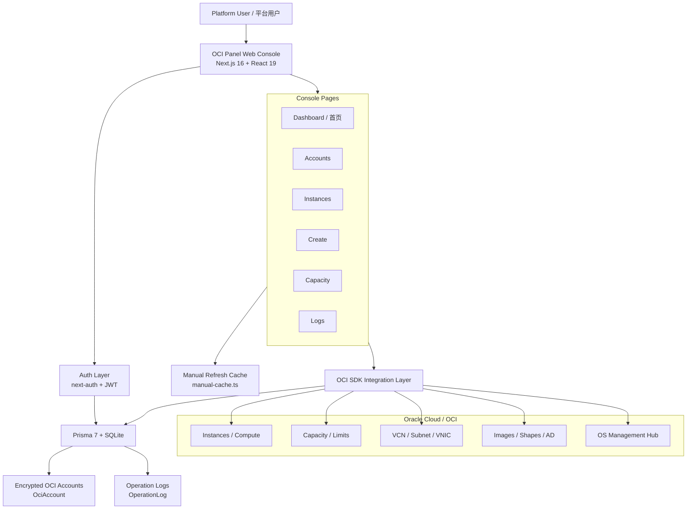
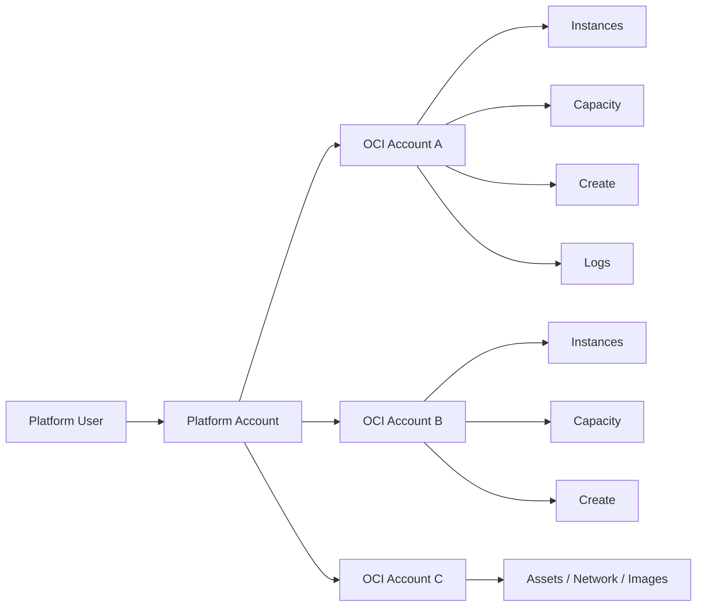
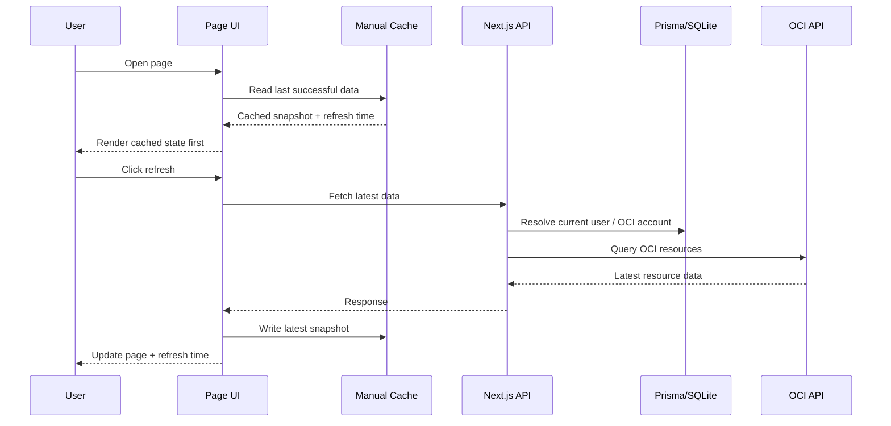

# Architecture

## High-level architecture

## Product structure

## Request and data strategy

## Notes

- Runtime source of truth is Prisma (`OciAccount`, `OperationLog`), not JSON files.
- The console follows a manual-refresh strategy instead of aggressive auto-refetching.
- Advanced DD / reinstall capability is moving toward OCI-native execution paths rather than SSH credential entry.
